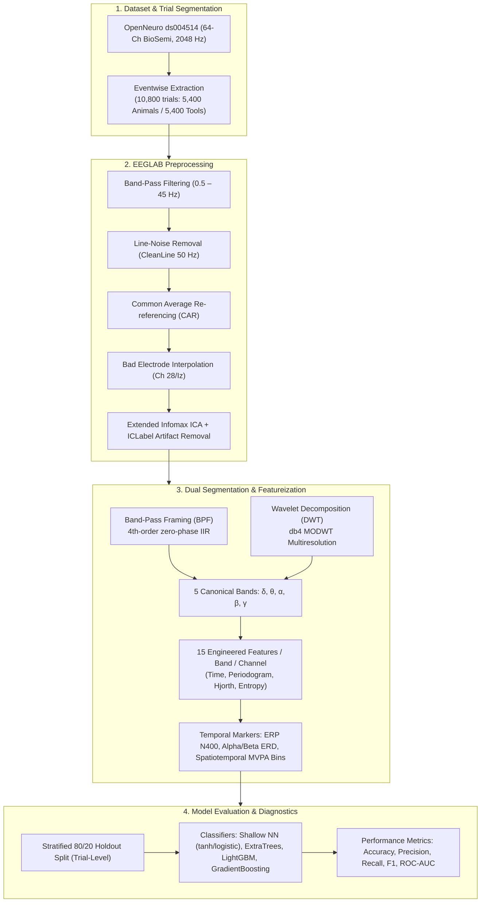

# Semantic Category Decoding in EEG Without Deep Models

[](https://sccn.ucsd.edu/eeglab/)
[](https://doi.org/10.18112/openneuro.ds004514.v1.1.2)
[](LICENSE)
[]()

An end-to-end, interpretable signal processing and machine learning pipeline for binary semantic category decoding (*Animals vs. Tools*) from 64-channel non-invasive EEG. This framework evaluates two distinct multiresolution feature engineering approaches—**Band-Pass Framing (BPF)** and **Discrete Wavelet Transform (DWT/MODWT)**—paired with classical machine learning classifiers without relying on opaque deep neural networks[cite: 3].

---

> ### ⚠️ Academic Project Context & Terms of Use
> This repository documents an undergraduate **Level 4, Term I (4-1)** academic research project in **Brain-Computer Interfaces (BCI)** conducted in the Department of Biomedical Engineering at Chittagong University of Engineering & Technology (CUET)[cite: 3].
> * **Unpublished Academic Work**: This project represents an exploratory academic proof-of-concept baseline[cite: 3].
> * **Intellectual Property & Academic Integrity**: This repository is published to demonstrate technical methodology and encourage academic replication. Direct verbatim copying or plagiarism of the code/report for university submissions is strictly prohibited. You are welcome to take inspiration and build upon the methodology provided proper attribution and citation are given[cite: 3].

---

## Pipeline Architecture



---

## Feature Representation Breakdown

Each single-trial epoch is transformed into an interpretable **5,123-dimensional feature vector**[cite: 3]:

| Feature Group | Computation Details | Dimensionality |
| :--- | :--- | :--- |
| **Per-Band Channel Features** | 12 core metrics (Mean, Std, Skewness, Kurtosis, Band Power, Log Band Power, Energy, Variance, Hjorth Activity, Hjorth Mobility, Relative Band Power, Spectral/Wavelet Entropy) across 5 bands ($\delta, \theta, \alpha, \beta, \gamma$) for 64 channels[cite: 3, 11] | $64 \times 5 \times 12 = 3,840$[cite: 3] |
| **Core Semantic Marker (N400)** | Baseline-corrected ERP mean amplitude over the centro-parietal cluster (`CPz`, `Pz`, `POz`) within 250–600 ms[cite: 3, 11] | $1$[cite: 3] |
| **Language ERD Desynchronization** | Event-Related Desynchronization (ERD) in $\alpha$ (8–13 Hz) and $\beta$ (13–30 Hz) over the Left Temporo-Parietal (LTP) cluster (`T7`, `FT7`, `TP7`, `P7`, `P5`, `P3`, `PO7`, `PO3`, `CP5`, `CP3`)[cite: 3, 11] | $2$[cite: 3] |
| **Spatiotemporal MVPA Bins** | 20 equal time-window bins over the 200–700 ms ERP window across all 64 channels[cite: 3, 11] | $20 \times 64 = 1,280$[cite: 3] |
| **Total Vector Size** | Concatenated trial representation[cite: 3] | **5,123 features / trial**[cite: 3] |

---

## Experimental Results

### 1. BPF vs. DWT Classifier Benchmark (Held-Out Test Set)

| Segmentation | Top Classifier Model | Test Accuracy | Precision | Recall | F1-Score | ROC-AUC |
| :--- | :--- | :--- | :--- | :--- | :--- | :--- |
| **BPF**[cite: 3] | **Neural Network (`tanh`, 100 units)**[cite: 3] | **0.559**[cite: 3] | **0.557**[cite: 3] | **0.578**[cite: 3] | **0.567**[cite: 3] | **0.572**[cite: 3] |
| **BPF**[cite: 3] | ExtraTrees[cite: 3] | 0.550[cite: 3] | 0.547[cite: 3] | 0.577[cite: 3] | 0.562[cite: 3] | 0.570[cite: 3] |
| **BPF**[cite: 3] | Neural Network (`logistic`, 100 units)[cite: 3] | 0.553[cite: 3] | 0.550[cite: 3] | 0.570[cite: 3] | 0.560[cite: 3] | 0.569[cite: 3] |
| **DWT**[cite: 3] | Wide Neural Network[cite: 3] | 0.545[cite: 3] | 0.543[cite: 3] | 0.542[cite: 3] | 0.542[cite: 3] | 0.556[cite: 3] |
| **DWT**[cite: 3] | Neural Network (Standard)[cite: 3] | 0.527[cite: 3] | 0.525[cite: 3] | 0.530[cite: 3] | 0.527[cite: 3] | 0.527[cite: 3] |
| **DWT**[cite: 3] | GradientBoosting[cite: 3] | 0.523[cite: 3] | 0.523[cite: 3] | 0.528[cite: 3] | 0.525[cite: 3] | 0.533[cite: 3] |

### 2. Feature Importance & Neurophysiological Alignment

Tree-ensemble feature importance on the DWT matrix revealed that discriminative power is concentrated in the **$\alpha$ and $\delta$ bands**, with localized contributions over **centro-parietal (`CP6`, `CP4`, `CP3`, `P2`, `P10`)** and **fronto-central (`FCz`, `AFz`, `FC3`)** electrode sites[cite: 3]. This directly aligns with the spatial topography of semantic retrieval and lexical N400 ERP components[cite: 3].

---

## Repository Structure

```text
├── .gitignore
├── LICENSE
├── README.md
├── Project.pdf
├── config/
│   └── CHANNEL_LOCS64_corrected_minimal.ced
└── scripts/
    ├── preprocessing/
    │   └── batch_preprocess.m
    └── features/
        ├── extract_bpf_features.m
        └── extract_dwt_features.m
```

---

## Getting Started

### Prerequisites
* MATLAB (R2021a or newer recommended)
* [EEGLAB Toolbox](https://sccn.ucsd.edu/eeglab/) (with `ICLabel` and `CleanLine` plugins installed)[cite: 4, 6]
* MATLAB Signal Processing & Wavelet Toolboxes

### Running the Preprocessing Pipeline
1. Place your event `.mat` files into class-separated directory trees (`animal_*` and `tool_*`)[cite: 3, 4].
2. Open `scripts/preprocessing/batch_preprocess.m` in MATLAB[cite: 4].
3. Set the `ROOT` path and `CED_FILE` location[cite: 4].
4. Execute the script to filter, remove line noise, compute ICA, and export preprocessed `.csv` files[cite: 3, 4].

### Extracting Features
* **For DWT Wavelet Features**: Run `scripts/features/extract_dwt_features.m`.
* **For BPF Band-Pass Features**: Run `scripts/features/extract_bpf_features.m`[cite: 9].

---

## Authors

* **Sifat Chowdhury** - *Department of Biomedical Engineering, Chittagong University of Engineering & Technology (CUET)* - [u2011015@student.cuet.ac.bd](mailto:u2011015@student.cuet.ac.bd)[cite: 3]
* **Dip Paul** - *Department of Biomedical Engineering, Chittagong University of Engineering & Technology (CUET)* - [u2011025@student.cuet.ac.bd](mailto:u2011025@student.cuet.ac.bd)[cite: 3]

---

## Citation

```bibtex
@misc{chowdhury_paul_2026_eeg_decoding,
  title={Semantic Category Decoding in EEG Without Deep Models: Replicating with BPF/DWT Features and ML Evaluation},
  author={Chowdhury, Sifat and Paul, Dip},
  year={2026},
  note={Undergraduate 4-1 Academic Project, Department of Biomedical Engineering, Chittagong University of Engineering and Technology (CUET)}
}
```
